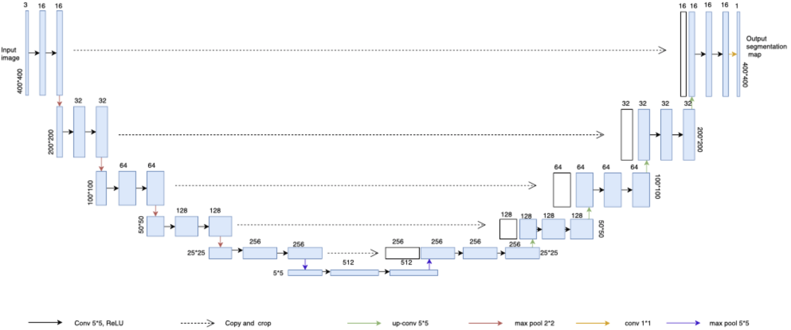

# Satellite Image Segmentation with Convolutional Neural Networks

This repository contains the code and report produced by our team 
 for the project 2 of the Machine Learning course at EPFL in 2018.
It uses a modified UNet to do a road segmentation.

Our best result on crowd.ai is done with the username Mare, submission id: 25240



# Table of Contents

* [Team Members](#team-members)
* [Environment](#Environment)
* [Libraries](#Libraries)
* [Technical problems](#technical)
* [Structure](#Structure)

# <a name="team-members"></a>Team Members
* Marijana Peti
* Loïc Wisniewski
* Christophe Minutolo

# <a name="Environment"></a>Environment

As training a deep learning model takes a long time and needs powerful computers, we
decided to use Google Colab to run our algorithms. We used the GPU runtime to accelerate the 
learning process. Moreover all useful libraries for deep learning are already available on Google Colab.

To reproduce results of this repository, you will have to put all the repository in Google Drive then run
in Google Colab this:

```python
from google.colab import drive
drive.mount('/content/drive')
%cd "your_path" # Path to your project folder in Google Drive
%pwd
```

Do not forget to set the accelerator on GPU in the runtime configuration of Google Colab.
You will have to put in `"your_path"/data/test_set_images` all images from the test set (they should not
have to be in sub-folders). You also have to put the saved weights in `"your_path"/model_weights.hdf5`.
This weights are available [here](https://drive.google.com/open?id=1rrJpub78m2gfERY4d7VbkhCGIu6Y8EjT).

Once done, you can run in Google Colab this code:

```python
from keras_prototyping import *
load_model_and_create_submission_file("./model_weights.hdf5", "./results.csv")
```

Or if you want to run it on your computer, you can just launch `run.py` in Google Colab
with the command `!python run.py`

It will output predictions in `"your_path"/results.csv`.

________________

If you want to recreate the model from scratch, you will have to download the training files available
on crowd.ai. Put images from 001 to 090 in the `"your_path"/data/training/train/images` and respective groundtruth in folder 
`"your_path"/data/training/train/groundtruth`. 
Put the rest in `"your_path"/data/training/validation/images` and `"your_path"/data/training/validation/groundtruth`.
Then you will be able to proceed to data augmentation and run the model generation:

```python
from keras_prototyping import *
import datatools
datatools.generate_files()
usage_example()
load_model_and_create_submission_file("./model_weights.hdf5", "./results.csv")
```

It will output the weight in `"your_path"/model_weights.hdf5`

# <a name="Libraries"></a>Libraries

This project use the following libraries:
- Keras
- TensorFlow
- matplotlib
- numpy
- PIL
- skimage

# <a name="technical"></a>Technical problems
On Google Cloud as memory is limited, we ofter had many OOM errors.
To reduce memory consumption, we decided to do all the data-augmentation before
starting the training, and save all augmentation in the training folder. Once done
we were able to write a custom data generator that gives to Keras data incrementally
to avoid to fill the memory that are not useful for now. You can check in the code
in `datatools.py` the function `custom_image_generator`.

# <a name="Structure"></a>Structure

 - `keras_prototyping.py` contains all the main function to launch models easily.
 - `plotting.py` contains plot functions, transformations from mask to images and from CSV to mask.
 - `models.py` contains the UNet models and some try to implement transfer learning.
 - `losses.py` contains all loss function (Dice, BCE + Loss) and monitor functions (Accuracy, F1 Score).
 - `datatools.py` contains function to do data augmentation.
 - `submission.py` contains functions to create CSV.
